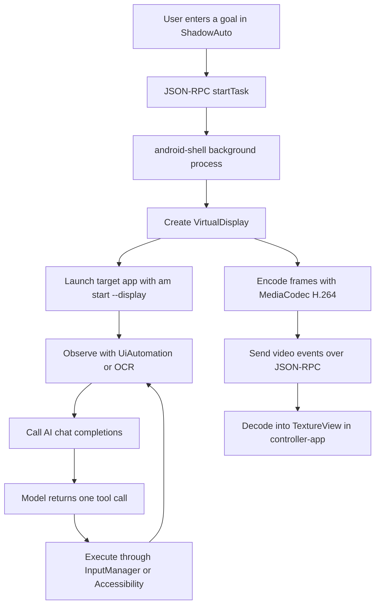

# Android Virtual Display and AI Background Automation

ShadowAuto is built around one idea: run a real Android app on a background virtual screen, let an AI model inspect that screen, choose the next action through tool calls, and inject touch, key, scroll, and text input events into the virtual display instead of the physical screen.

This is different from a coordinate script. The target app does not need to occupy the main display, and the automation loop does not depend on fixed screen positions. The controller app only collects the user goal, shows the virtual screen stream, and displays progress logs. The actual perception, reasoning, and execution all happen inside the shell process.

This document focuses on two parts:

- How Android virtual display streaming, UI observation, OCR fallback, and display-targeted input injection work.
- How the AI model is called with streaming chat completions and tool calls to drive a ReAct-style automation loop.

TangoADB/WebUSB is only used as a convenient browser launcher. It is not the core automation layer.

## Architecture

ShadowAuto has three main modules:

- `android-shell`: a background shell process started by `adb shell` and `app_process`. It creates the VirtualDisplay, launches target apps, reads UI and OCR data, calls the AI model, executes tool calls, and streams the virtual display.
- `controller-app`: the Android controller app. It configures the model, accepts user goals, shows the virtual screen, displays logs, and stops tasks.
- `web-launcher`: a Svelte + TangoADB WebUSB launcher. It uploads the shell APK, OCR runtime, and controller APK to the device, then starts the shell process with `app_process`.

High-level flow:



## Why app_process

A normal Android app is constrained by the app sandbox. It cannot reliably access the system-level capabilities needed for this design:

- Creating a touch-capable VirtualDisplay with independent focus.
- Injecting input events into a specific display through hidden APIs.
- Reading windows across displays with UiAutomation.
- Moving the IME to the virtual display.

ShadowAuto puts the automation engine in a shell process:

```sh
adb shell "CLASSPATH=/data/local/tmp/silent-shell.apk nohup sh -c 'exec app_process /system/bin com.silentauto.shell.Main --port=43110' >/data/local/tmp/silent-auto.log 2>&1 </dev/null &"
```

The process runs with shell permissions, which is enough for Android 10 and later. Root is not required.

After startup, the shell process listens only on loopback:

```text
127.0.0.1:43110
```

The controller app talks to it through local TCP JSON-RPC. The port is not meant to be exposed to external networks.

## Creating the VirtualDisplay

An Android `VirtualDisplay` is an independent display backed by a `Surface`. If an app is launched onto that display, the system renders that app into the supplied surface.

ShadowAuto creates the display with public flags plus hidden flags when available:

```java
int flags = DisplayManager.VIRTUAL_DISPLAY_FLAG_PUBLIC
        | DisplayManager.VIRTUAL_DISPLAY_FLAG_PRESENTATION
        | DisplayManager.VIRTUAL_DISPLAY_FLAG_OWN_CONTENT_ONLY
        | hiddenFlag("VIRTUAL_DISPLAY_FLAG_SUPPORTS_TOUCH")
        | hiddenFlag("VIRTUAL_DISPLAY_FLAG_OWN_FOCUS")
        | hiddenFlag("VIRTUAL_DISPLAY_FLAG_TRUSTED");

VirtualDisplay display = manager.createVirtualDisplay(
        "ShadowAuto",
        width,
        height,
        dpi,
        outputSurface,
        flags
);
```

This code lives in `android-shell/src/main/java/com/silentauto/shell/VirtualDisplaySession.java`.

The important behavior:

- `PUBLIC` allows apps to be launched on the display.
- `PRESENTATION` makes the display suitable for independent content.
- `OWN_CONTENT_ONLY` keeps the display scoped to its own content.
- `SUPPORTS_TOUCH` allows touch events to target it.
- `OWN_FOCUS` helps the virtual display keep independent focus.
- `TRUSTED` makes some window and input paths more stable.

Hidden flags are read reflectively so the code can run across Android versions:

```java
private static int hiddenFlag(String name) {
    try {
        Field field = DisplayManager.class.getDeclaredField(name);
        field.setAccessible(true);
        return field.getInt(null);
    } catch (Throwable ignored) {
        return 0;
    }
}
```

Once the display is created, everything else must use its `displayId`: launching apps, dumping UI, capturing frames, injecting input, and locating the IME.

## Launching an app on the virtual display

After the shell process gets a `displayId`, it can launch an app onto that display:

```java
String command = "am start --display " + displayId
        + " -f 0x10008000 -n " + shellQuote(component.flattenToShortString());

new ProcessBuilder("sh", "-c", command)
        .redirectErrorStream(true)
        .start();
```

Before launching, ShadowAuto lists installed apps that have a launcher intent:

```java
for (ApplicationInfo app : pm.getInstalledApplications(PackageManager.GET_META_DATA)) {
    if (pm.getLaunchIntentForPackage(app.packageName) == null) {
        continue;
    }
    result.add(new AppInfo(label, app.packageName));
}
```

The AI model receives the app list and the user goal, then chooses a package name. For example, if the user says "use Meituan Waimai to order a Starbucks vanilla latte", the model should select the Meituan Waimai package, and the shell starts that package on the virtual display.

## Real-time virtual screen streaming

The simplest screen preview design is repeated screenshots: capture a bitmap, encode it, send it to the controller, repeat. That is easy, but slow:

- Every frame is a full image.
- Bitmap encoding and decoding are expensive.
- Latency is high and frame rate is low.

ShadowAuto streams video instead. The VirtualDisplay renders directly into a `MediaCodec` encoder input surface. The encoder outputs H.264 config and samples, and the controller app decodes them into a `TextureView`.

Encoder setup:

```java
MediaFormat format = MediaFormat.createVideoFormat(
        MediaFormat.MIMETYPE_VIDEO_AVC,
        width,
        height
);
format.setInteger(MediaFormat.KEY_COLOR_FORMAT,
        MediaCodecInfo.CodecCapabilities.COLOR_FormatSurface);
format.setInteger(MediaFormat.KEY_BIT_RATE, bitRateFor(width, height));
format.setInteger(MediaFormat.KEY_FRAME_RATE, 8);
format.setInteger(MediaFormat.KEY_I_FRAME_INTERVAL, 1);

MediaCodec codec = MediaCodec.createEncoderByType(MediaFormat.MIMETYPE_VIDEO_AVC);
codec.configure(format, null, null, MediaCodec.CONFIGURE_FLAG_ENCODE);
Surface inputSurface = codec.createInputSurface();
```

Then the VirtualDisplay is created using that `inputSurface`.

When encoded output is available, the shell sends compressed H.264 samples:

```java
byte[] bytes = new byte[info.size];
data.position(info.offset);
data.limit(info.offset + info.size);
data.get(bytes);

logs.videoSample(
        taskId,
        info.presentationTimeUs,
        info.flags,
        Base64.encodeToString(bytes, Base64.NO_WRAP)
);
```

On the controller side, `video.config` initializes the decoder and `video.sample` feeds the sample queue:

```java
MediaFormat format = MediaFormat.createVideoFormat(mime, width, height);
format.setByteBuffer("csd-0", ByteBuffer.wrap(csd0));

decoder = MediaCodec.createDecoderByType(mime);
decoder.configure(format, surface, null, 0);
decoder.start();
```

This keeps bandwidth and CPU lower than image delivery, and the preview feels much closer to a real screen stream.

## UI observation with UiAutomation

The AI needs to know what is currently on the virtual screen. ShadowAuto uses `UiAutomation` to read accessibility windows and nodes.

The important detail is display filtering. On newer Android versions, the code calls `getWindowsOnAllDisplays()` and picks the target display:

```java
Method method = UiAutomation.class.getMethod("getWindowsOnAllDisplays");
SparseArray<List<AccessibilityWindowInfo>> all =
        (SparseArray<List<AccessibilityWindowInfo>>) method.invoke(automation);

List<AccessibilityWindowInfo> result = all.get(displayId);
```

This avoids a common failure mode: the target app is running on the virtual display, but the UI dump accidentally reads the main display.

ShadowAuto returns two UI dump modes:

- `simple`: a compact, model-friendly layout with actionable targets, editable inputs, labels, bounds, and indexes.
- `full`: the complete accessibility tree for diagnosis or difficult pages.

The result explicitly marks the coordinate space:

```json
{
  "displayId": 12,
  "width": 1080,
  "height": 2400,
  "mode": "simple",
  "coordinateSpace": "display-local",
  "inputs": [],
  "targets": []
}
```

`display-local` is critical. The AI and the executor must use coordinates inside the virtual display, not pixels from the controller preview and not coordinates from the physical screen.

## OCR fallback

Some apps do not expose useful accessibility nodes. Self-rendered pages, complex e-commerce views, maps, and security pages can appear visually rich while the UI tree is empty or incomplete.

For those cases ShadowAuto exposes a `get_screen_ocr` tool. The shell captures the current virtual display frame, runs Paddle Lite OCR, and returns text, confidence, and bounding boxes.

Frame capture uses the virtual display itself. It temporarily switches the VirtualDisplay surface to an `ImageReader`, captures the latest image, and restores the video surface:

```java
synchronized Bitmap captureBitmap(int retries, long delayMs) {
    Surface restoreSurface = outputSurface;
    Image image = null;
    try {
        drainCaptureReader();
        display.setSurface(captureSurface);
        image = captureReader.acquireLatestImage();
        return ScreenCapture.bitmapFromImage(image);
    } finally {
        display.setSurface(restoreSurface);
    }
}
```

OCR results are also display-local:

```json
{
  "text": "Starbucks\nVanilla Latte",
  "results": [
    {
      "index": 0,
      "text": "Vanilla Latte",
      "confidence": 0.96,
      "bounds": {
        "left": 120,
        "top": 820,
        "right": 420,
        "bottom": 900,
        "centerX": 270,
        "centerY": 860
      }
    }
  ]
}
```

When accessibility is sparse, the model can use OCR text and bounds to continue with `tap`, `scroll_ui`, or another observation tool.

## Display-targeted input injection

Input is the most fragile part of virtual display automation. If the event does not carry the target display id, it may land on the main screen.

ShadowAuto reflects `InputEvent#setDisplayId()` and then calls `InputManager#injectInputEvent()`:

```java
private boolean send(int displayId, InputEvent event) throws Exception {
    setDisplayId.invoke(event, displayId);
    Object result = inject.invoke(inputManager, event, INJECT_WAIT_FOR_FINISH);
    return !(result instanceof Boolean) || (Boolean) result;
}
```

A tap is just a display-targeted down/up pair:

```java
boolean tap(int displayId, int x, int y) throws Exception {
    long now = SystemClock.uptimeMillis();
    MotionEvent down = motion(now, now, MotionEvent.ACTION_DOWN, x, y);
    MotionEvent up = motion(now, now + 80, MotionEvent.ACTION_UP, x, y);
    return send(displayId, down) && send(displayId, up);
}
```

Keys also target the virtual display:

```java
boolean key(int displayId, int keyCode) throws Exception {
    long now = SystemClock.uptimeMillis();
    boolean downOk = send(displayId, new KeyEvent(now, now, KeyEvent.ACTION_DOWN, keyCode, 0));
    boolean upOk = send(displayId, new KeyEvent(now, now + 20, KeyEvent.ACTION_UP, keyCode, 0));
    return downOk && upOk;
}
```

For text input, ShadowAuto uses a layered strategy:

1. Use Accessibility `ACTION_SET_TEXT` when possible.
2. If that fails, set the clipboard and paste.
3. If that fails, fall back to key events.

This handles Chinese input, search fields, normal `EditText`, and some custom input widgets better than key events alone.

## IME on the virtual display

If the user taps an input inside the virtual display but the soft keyboard appears on the physical display, search and submit actions become unreliable.

ShadowAuto attempts to set the display IME policy when the virtual display is created:

```java
this.previousImePolicy = windowManager.getDisplayImePolicy(displayId);
this.localImeEnabled = windowManager.setDisplayImePolicy(
        displayId,
        WindowManagerBridge.DISPLAY_IME_POLICY_LOCAL
);
```

When supported by the device, the IME belongs to the virtual display. When unsupported, text still usually works through Accessibility or clipboard paste, so the system does not rely only on visible soft keyboard behavior.

## AI model calls

The AI model is called from the shell process, not from the controller app. This keeps the automation loop short and allows the shell to stream AI tokens, tool decisions, logs, and video events through one channel.

The request uses an OpenAI-compatible `/chat/completions` endpoint:

```java
JsonObject body = new JsonObject();
body.addProperty("model", config.model);
body.addProperty("stream", true);
body.addProperty("tool_choice", "auto");
body.add("messages", messages);
body.add("tools", tools);

Request request = new Request.Builder()
        .url(config.apiBase + "/chat/completions")
        .addHeader("Authorization", "Bearer " + config.apiKey)
        .addHeader("Accept", "text/event-stream")
        .post(RequestBody.create(body.toString(), JSON))
        .build();
```

The streaming parser handles both normal text and tool call deltas:

```java
if (choice.has("delta")) {
    JsonObject delta = choice.getAsJsonObject("delta");
    readToolCalls(delta.get("tool_calls"), tools);
    return delta.has("content") && !delta.get("content").isJsonNull()
            ? delta.get("content").getAsString()
            : "";
}
```

Tool call arguments may arrive in chunks, so the shell aggregates them by `index`:

```java
int index = item.has("index") ? item.get("index").getAsInt() : i;
ToolCallBuilder builder = tools.get(index);
if (builder == null) {
    builder = new ToolCallBuilder();
    tools.put(index, builder);
}

JsonObject fn = item.getAsJsonObject("function");
builder.name.append(fn.get("name").getAsString());
builder.arguments.append(fn.get("arguments").getAsString());
```

The final tool call looks like:

```json
{
  "name": "tap_target",
  "arguments": {
    "targetIndex": 3,
    "reason": "Open the search field"
  }
}
```

## The ReAct loop

ShadowAuto runs a ReAct-style loop:

1. Observe the current UI with a simple dump.
2. Ask the model to choose exactly one tool.
3. Execute the tool.
4. Observe the updated UI.
5. Repeat until the model calls `finish`, the user stops the task, or an error occurs.

The prompt enforces the display and tool constraints:

```text
You control an Android app on a 1080x2400 virtual display.
Rules:
1. Call exactly one tool, never answer with prose.
2. Coordinates are display-local in this virtual display.
3. Prefer tap_target using targetIndex from targets.
4. Use focus_input before input_text.
5. Use get_screen_ocr when UI layout is sparse, empty, wrong.
```

Available tools include:

```text
get_ui_layout
get_screen_ocr
tap_target
tap
long_press
drag
scroll_ui
focus_input
input_text
set_clipboard
paste_clipboard
copy_selection
select_all_text
delete_selection
clear_text
press_back
press_key
wait
finish
```

The executor does not blindly trust the model. It adds general safeguards:

- If a search field was focused and the model waits instead of typing, the executor can send the extracted search text.
- If text was entered and the model waits or goes back, the executor can submit search first.
- If the post-search UI tree is sparse, the executor avoids immediately pressing Back and prefers OCR, full layout, wait, or scroll.

These are not per-app rules. They are general corrections for common automation failure modes.

## Logs and progress events

The shell pushes logs, AI token deltas, and video frames as JSON-RPC events:

```java
JsonObject event = new JsonObject();
event.addProperty("jsonrpc", "2.0");
event.addProperty("method", "event");
event.add("params", params);
```

Logs are visible in the controller app and in logcat:

```sh
adb logcat -v time -s ShadowAutoShell
```

For debugging, layout dumps and OCR results are also written to logcat so a developer can verify what the AI actually saw.

## How to use it

### 1. Build

```sh
./gradlew :android-shell:assembleDebug :controller-app:assembleDebug
./gradlew :android-shell:syncWebLauncherArtifacts
```

`syncWebLauncherArtifacts` copies these files into `web-launcher/static`:

- `silent-shell.apk`
- `controller-app.apk`
- Paddle Lite OCR native libraries
- Paddle OCR models and label files

### 2. Start the shell process

The recommended path is the online launcher:

```text
https://android-notes.github.io/ShadowAuto/
```

Click `Start ShadowAuto Assistant`, select the Android device, and allow the prompts on the phone.

Manual ADB startup:

```sh
adb push web-launcher/static/silent-shell.apk /data/local/tmp/silent-shell.apk
adb push web-launcher/static/ocr/. /data/local/tmp/shadowauto/ocr/
adb shell "CLASSPATH=/data/local/tmp/silent-shell.apk nohup sh -c 'exec app_process /system/bin com.silentauto.shell.Main --port=43110' >/data/local/tmp/silent-auto.log 2>&1 </dev/null &"
```

### 3. Configure the AI model

Open the ShadowAuto app and set:

- API key
- API URL, such as `https://api.deepseek.com` or another OpenAI-compatible endpoint
- Model name

The provider must support:

- OpenAI-compatible chat completions
- `stream: true`
- tool calls

### 4. Run a task

Example goal:

```text
Use Meituan Waimai to order a grande Starbucks vanilla latte.
```

After tapping Run:

1. The controller app calls `startTask`.
2. The shell creates the virtual display and launches the selected app.
3. The controller app starts showing the virtual screen.
4. Logs show AI tokens, tool calls, and execution progress.
5. The user can stop the current task or stop all tasks.

## What TangoADB does

TangoADB is only the browser-to-phone transport for setup:

- Select a WebUSB device.
- Upload the shell APK, controller APK, and OCR runtime.
- Execute the `app_process` start command.
- Reinstall and open the controller app.

The real automation logic remains inside `android-shell`: VirtualDisplay, UI dump, OCR, AI calls, tool execution, and input injection.

## Common issues

### Tap positions are offset

This is usually a coordinate-space bug. Check that:

- UI dump coordinates are display-local.
- Preview view pixels are not used as tap coordinates.
- Every injected `InputEvent` receives the target `displayId`.
- Physical status bar offsets are not applied to virtual display coordinates.

### UI dump is empty but the screen has content

The page may be accessibility-opaque or self-rendered. Use `get_screen_ocr` to recover visible text and display-local bounds.

### Text input fails

Common causes:

- The input field is not focused.
- The IME is on the physical display instead of the virtual display.
- The page blocks Accessibility text setting.
- Parallel tasks overwrite each other's clipboard text.

ShadowAuto tries Accessibility text setting first, then clipboard paste, then key events.

### The virtual screen becomes black

Some Android security policies block capture on sensitive pages, such as payment password screens. The automation may still be running, but the stream can show black frames.

## Summary

The core of Android virtual display automation is keeping display ownership consistent:

- `VirtualDisplay` hosts the target app.
- `MediaCodec` streams the display as H.264.
- `UiAutomation` and OCR provide screen understanding.
- `InputManager` injects events into the same display.
- The AI model drives the loop through tool calls.

When those pieces are bound to one `displayId`, an AI assistant can operate an Android app in the background while the user continues using the physical screen.
