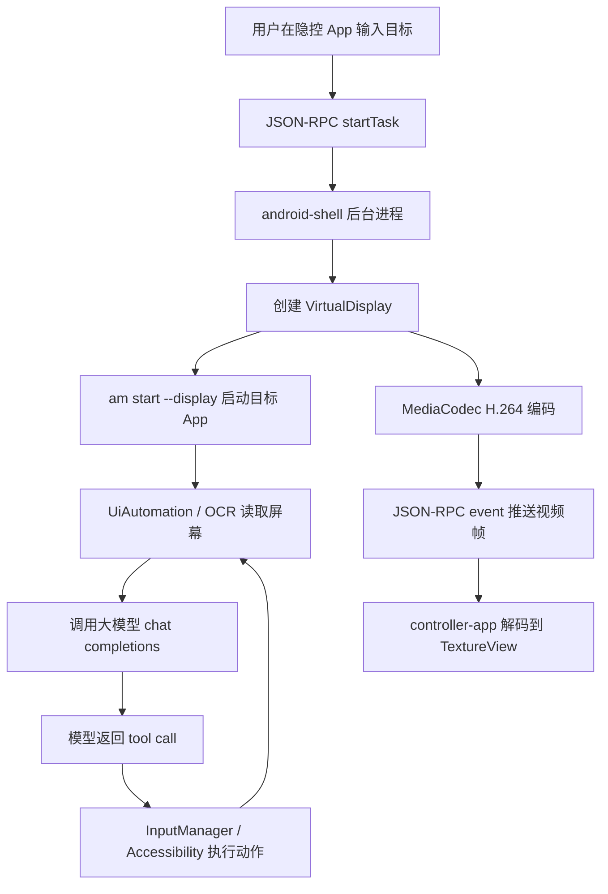

# Android 虚拟投屏与 AI 后台静默自动化实践

[English version](android-virtual-display-ai-automation.en.md)

隐控 ShadowAuto 的核心目标是：让真实 Android 应用运行在后台虚拟屏中，由 AI 大模型读取屏幕状态、决定下一步动作，并把点击、输入、滚动等事件注入到这个虚拟屏，而不是用户正在使用的主屏幕。

这类架构和普通脚本点击最大的区别在于：它不依赖固定坐标，也不要求目标 App 出现在实体屏幕上。自动化任务运行在 `VirtualDisplay`，控制端 App 只负责输入目标、展示虚拟投屏和进度日志；真正的感知、推理和执行都在 shell 进程内完成。

本文主要讲两部分：

- Android 虚拟屏创建、投屏、UI 感知和输入注入的实现原理。
- AI 大模型如何通过流式输出和 tool call 驱动 ReAct 自动化循环。

TangoADB/WebUSB 只是浏览器里启动 shell 进程的一种分发方式，本文只会一笔带过。

## 整体架构

ShadowAuto 分为三个模块：

- `android-shell`：通过 `adb shell` + `app_process` 启动的后台进程。负责创建虚拟屏、启动目标 App、读取 UI/OCR、调用大模型、执行 tool call、推送投屏视频流。
- `controller-app`：用户手机上的控制端 App。负责配置大模型、输入自动化目标、显示虚拟投屏、显示日志、停止任务。
- `web-launcher`：浏览器启动器。通过 TangoADB 把 shell APK、OCR 文件和 controller APK 发送到手机，并执行 `app_process` 启动命令。

核心链路如下：



## 为什么用 app_process 启动 shell 进程

普通 Android App 受应用沙箱限制，很难直接访问很多系统级能力，例如：

- 创建带触摸能力和独立焦点的 `VirtualDisplay`。
- 通过 hidden API 指定 display 注入输入事件。
- 使用 `UiAutomation` 读取所有窗口。
- 修改虚拟屏上的 IME 策略，让软键盘显示在指定 display。

ShadowAuto 的做法是把自动化核心放到一个 shell 进程里运行：

```sh
adb shell "CLASSPATH=/data/local/tmp/silent-shell.apk \
  nohup setsid app_process /system/bin com.silentauto.shell.Main \
  --port=43110 >/data/local/tmp/silent-auto.log 2>&1 </dev/null &"
```

这样进程以 shell 身份运行，可以在 Android 10 及以上设备上使用 shell 权限访问系统服务和部分 hidden API，不需要 root。

shell 进程启动后只监听本机回环地址：

```text
127.0.0.1:43110
```

控制端 App 通过本机 TCP JSON-RPC 和它通信。外部网络无法直接访问这个端口。

## 虚拟屏创建原理

Android 的 `VirtualDisplay` 本质上是一个独立 display。只要给它一个渲染目标 `Surface`，系统就可以把应用画面绘制到这个 Surface 上。

ShadowAuto 创建虚拟屏时使用了几类关键 flag：

```java
int flags = DisplayManager.VIRTUAL_DISPLAY_FLAG_PUBLIC
        | DisplayManager.VIRTUAL_DISPLAY_FLAG_PRESENTATION
        | DisplayManager.VIRTUAL_DISPLAY_FLAG_OWN_CONTENT_ONLY
        | hiddenFlag("VIRTUAL_DISPLAY_FLAG_SUPPORTS_TOUCH")
        | hiddenFlag("VIRTUAL_DISPLAY_FLAG_OWN_FOCUS")
        | hiddenFlag("VIRTUAL_DISPLAY_FLAG_TRUSTED");

VirtualDisplay display = manager.createVirtualDisplay(
        "ShadowAuto",
        width,
        height,
        dpi,
        outputSurface,
        flags
);
```

这段逻辑位于 `android-shell/src/main/java/com/silentauto/shell/VirtualDisplaySession.java`。

几个 flag 的作用可以简单理解为：

- `PUBLIC`：让系统认为这是一个可见 display，应用可以启动到上面。
- `PRESENTATION`：适合承载独立展示内容。
- `OWN_CONTENT_ONLY`：只显示该虚拟屏自己的内容。
- `SUPPORTS_TOUCH`：允许触摸事件落到虚拟屏。
- `OWN_FOCUS`：虚拟屏可以拥有独立焦点，避免焦点总被主屏抢走。
- `TRUSTED`：让系统按可信显示屏处理，部分窗口和输入场景更稳定。

这些隐藏 flag 不同 Android 版本可能存在差异，所以代码通过反射读取：

```java
private static int hiddenFlag(String name) {
    try {
        Field field = DisplayManager.class.getDeclaredField(name);
        field.setAccessible(true);
        return field.getInt(null);
    } catch (Throwable ignored) {
        return 0;
    }
}
```

创建完成后可以拿到 `displayId`。后续所有启动应用、读取布局、输入注入都必须围绕这个 `displayId` 做，否则就会误操作主屏幕。

## 把 App 启动到虚拟屏

拿到 `displayId` 后，可以通过 `am start --display` 把目标 App 拉起到指定虚拟屏：

```java
String command = "am start --display " + displayId
        + " -f 0x10008000 -n " + shellQuote(component.flattenToShortString());

new ProcessBuilder("sh", "-c", command)
        .redirectErrorStream(true)
        .start();
```

在实际自动化前，shell 会先读取手机上所有可启动应用：

```java
for (ApplicationInfo app : pm.getInstalledApplications(PackageManager.GET_META_DATA)) {
    if (pm.getLaunchIntentForPackage(app.packageName) == null) {
        continue;
    }
    result.add(new AppInfo(label, app.packageName));
}
```

然后让大模型根据用户目标选择包名。例如用户说“用美团外卖买杯咖啡”，模型应该从应用列表中选择美团外卖对应的 package，再由 shell 启动。

## 虚拟投屏为什么用视频流

早期最简单的投屏方式是截图：周期性抓取 Bitmap，然后发给控制端。这个方案实现简单，但性能很差：

- 每帧都是完整图片，带宽和 CPU 开销高。
- 帧率低，操作反馈明显滞后。
- 图片编码、Base64、解码都会带来额外延迟。

ShadowAuto 现在采用更接近 scrcpy 的方式：让 `VirtualDisplay` 直接渲染到 `MediaCodec` 的输入 Surface，由系统硬件编码成 H.264，再把编码后的数据推给控制端 App。

关键流程是：

1. shell 创建 H.264 encoder。
2. 从 encoder 获取 input surface。
3. 创建 VirtualDisplay 时把这个 surface 作为 outputSurface。
4. encoder 不断输出 H.264 config 和 sample。
5. shell 通过 JSON-RPC event 把视频数据发给 controller-app。
6. controller-app 用 `MediaCodec` decoder 解码到 `TextureView`。

编码端关键代码在 `VideoStreamer`：

```java
MediaFormat format = MediaFormat.createVideoFormat(
        MediaFormat.MIMETYPE_VIDEO_AVC,
        width,
        height
);
format.setInteger(MediaFormat.KEY_COLOR_FORMAT,
        MediaCodecInfo.CodecCapabilities.COLOR_FormatSurface);
format.setInteger(MediaFormat.KEY_BIT_RATE, bitRateFor(width, height));
format.setInteger(MediaFormat.KEY_FRAME_RATE, 8);
format.setInteger(MediaFormat.KEY_I_FRAME_INTERVAL, 1);

MediaCodec codec = MediaCodec.createEncoderByType(MediaFormat.MIMETYPE_VIDEO_AVC);
codec.configure(format, null, null, MediaCodec.CONFIGURE_FLAG_ENCODE);
Surface inputSurface = codec.createInputSurface();
```

输出视频帧时，只发送压缩后的 H.264 sample：

```java
byte[] bytes = new byte[info.size];
data.position(info.offset);
data.limit(info.offset + info.size);
data.get(bytes);

logs.videoSample(
        taskId,
        info.presentationTimeUs,
        info.flags,
        Base64.encodeToString(bytes, Base64.NO_WRAP)
);
```

控制端收到 `video.config` 后初始化 decoder，收到 `video.sample` 后送入 decoder：

```java
MediaFormat format = MediaFormat.createVideoFormat(mime, width, height);
format.setByteBuffer("csd-0", ByteBuffer.wrap(csd0));

decoder = MediaCodec.createDecoderByType(mime);
decoder.configure(format, surface, null, 0);
decoder.start();
```

这种方式比传图片更适合实时投屏：数据量更低，延迟更稳定，控制端也可以直接用系统硬解码渲染。

## UI 感知：指定 display 的 UiAutomation

AI 要做自动化，首先必须知道当前屏幕上有什么。

ShadowAuto 使用 `UiAutomation` 读取无障碍窗口和节点，并且优先调用 Android 新版本支持的 `getWindowsOnAllDisplays()`，从所有 display 中筛选当前虚拟屏：

```java
Method method = UiAutomation.class.getMethod("getWindowsOnAllDisplays");
SparseArray<List<AccessibilityWindowInfo>> all =
        (SparseArray<List<AccessibilityWindowInfo>>) method.invoke(automation);

List<AccessibilityWindowInfo> result = all.get(displayId);
```

这样可以避免一个常见问题：明明目标 App 已经在虚拟屏上打开了，但 UI dump 拿到的却是主屏窗口。

dump 返回两种模式：

- `simple`：面向 AI 的简化布局，只保留可操作节点、输入框、目标索引、坐标、文本等。
- `full`：完整节点树，用于 simple 信息不足时进一步诊断。

返回数据会明确标注坐标系：

```json
{
  "displayId": 12,
  "width": 1080,
  "height": 2400,
  "mode": "simple",
  "coordinateSpace": "display-local",
  "inputs": [],
  "targets": []
}
```

这里的 `display-local` 很重要。AI 和执行器都必须使用虚拟屏本地坐标，不能使用控制端预览图上的像素坐标，也不能把状态栏高度当成主屏幕状态栏来修正。

## OCR 兜底：当 UI 节点不可用

很多页面并不会暴露完整无障碍节点，例如自绘页面、复杂列表、部分电商页面、地图、支付安全页面等。此时 UI dump 可能为空，但屏幕上明明有文字。

ShadowAuto 提供 `get_screen_ocr` tool。shell 会从虚拟屏抓取当前画面，调用 Paddle Lite OCR，返回文本、置信度和坐标框。

截图路径不是从主屏截图，而是临时把 VirtualDisplay 的 Surface 切到 `ImageReader`：

```java
synchronized Bitmap captureBitmap(int retries, long delayMs) {
    Surface restoreSurface = outputSurface;
    Image image = null;
    try {
        drainCaptureReader();
        display.setSurface(captureSurface);
        image = captureReader.acquireLatestImage();
        return ScreenCapture.bitmapFromImage(image);
    } finally {
        display.setSurface(restoreSurface);
    }
}
```

OCR 结果会按 display-local 坐标返回：

```json
{
  "text": "星巴克\\n香草拿铁",
  "results": [
    {
      "index": 0,
      "text": "香草拿铁",
      "confidence": 0.96,
      "bounds": {
        "left": 120,
        "top": 820,
        "right": 420,
        "bottom": 900,
        "centerX": 270,
        "centerY": 860
      }
    }
  ]
}
```

这样模型即使拿不到无障碍节点，也可以根据 OCR 坐标调用 `tap` 或 `scroll_ui` 继续执行。

## 输入注入：一定要带 displayId

虚拟屏自动化最容易出错的地方是输入注入。如果不指定 display，点击和按键可能会落到主屏幕。

ShadowAuto 通过反射调用 `InputEvent#setDisplayId()`，再使用 `InputManager#injectInputEvent()` 注入：

```java
private boolean send(int displayId, InputEvent event) throws Exception {
    setDisplayId.invoke(event, displayId);
    Object result = inject.invoke(inputManager, event, INJECT_WAIT_FOR_FINISH);
    return !(result instanceof Boolean) || (Boolean) result;
}
```

触摸事件就是一组带 displayId 的 down/up：

```java
boolean tap(int displayId, int x, int y) throws Exception {
    long now = SystemClock.uptimeMillis();
    MotionEvent down = motion(now, now, MotionEvent.ACTION_DOWN, x, y);
    MotionEvent up = motion(now, now + 80, MotionEvent.ACTION_UP, x, y);
    return send(displayId, down) && send(displayId, up);
}
```

按键也一样：

```java
boolean key(int displayId, int keyCode) throws Exception {
    long now = SystemClock.uptimeMillis();
    boolean downOk = send(displayId, new KeyEvent(now, now, KeyEvent.ACTION_DOWN, keyCode, 0));
    boolean upOk = send(displayId, new KeyEvent(now, now + 20, KeyEvent.ACTION_UP, keyCode, 0));
    return downOk && upOk;
}
```

文本输入优先级则是：

1. 通过 Accessibility `ACTION_SET_TEXT` 直接设置文本。
2. 如果失败，设置剪贴板并执行粘贴。
3. 如果仍失败，再退回到 key event 输入。

这样可以兼容中文输入、搜索框、普通 EditText，以及部分定制输入组件。

## 软键盘显示到虚拟屏

点击虚拟屏输入框后，如果 IME 仍显示在主屏，搜索、回车、输入都会变得不稳定。

ShadowAuto 在创建虚拟屏后会尝试设置该 display 的 IME policy：

```java
this.previousImePolicy = windowManager.getDisplayImePolicy(displayId);
this.localImeEnabled = windowManager.setDisplayImePolicy(
        displayId,
        WindowManagerBridge.DISPLAY_IME_POLICY_LOCAL
);
```

如果系统支持，软键盘会出现在虚拟屏内部；如果不支持，则自动化仍会优先使用 Accessibility 设置文本和剪贴板粘贴，减少对软键盘位置的依赖。

## AI 调用：流式 Chat Completions + tool call

ShadowAuto 的大模型调用发生在 shell 进程内，而不是 controller-app 内。这样有两个好处：

- 自动化循环不用来回跨进程等待 App 再请求 AI，链路更短。
- 模型输出 token、tool call、日志和投屏可以统一通过 shell 推送到控制端。

请求体使用 OpenAI 兼容的 `/chat/completions`：

```java
JsonObject body = new JsonObject();
body.addProperty("model", config.model);
body.addProperty("stream", true);
body.addProperty("tool_choice", "auto");
body.add("messages", messages);
body.add("tools", tools);

Request request = new Request.Builder()
        .url(config.apiBase + "/chat/completions")
        .addHeader("Authorization", "Bearer " + config.apiKey)
        .addHeader("Accept", "text/event-stream")
        .post(RequestBody.create(body.toString(), JSON))
        .build();
```

读取流式响应时，需要同时处理两类 delta：

- `content`：模型普通文本输出，用于实时展示。
- `tool_calls`：模型决定调用哪个工具，以及工具参数。

关键解析逻辑如下：

```java
if (choice.has("delta")) {
    JsonObject delta = choice.getAsJsonObject("delta");
    readToolCalls(delta.get("tool_calls"), tools);
    return delta.has("content") && !delta.get("content").isJsonNull()
            ? delta.get("content").getAsString()
            : "";
}
```

tool call 参数在流式响应里可能被拆成多段，所以需要按 `index` 聚合：

```java
int index = item.has("index") ? item.get("index").getAsInt() : i;
ToolCallBuilder builder = tools.get(index);
if (builder == null) {
    builder = new ToolCallBuilder();
    tools.put(index, builder);
}

JsonObject fn = item.getAsJsonObject("function");
builder.name.append(fn.get("name").getAsString());
builder.arguments.append(fn.get("arguments").getAsString());
```

最终得到一个完整工具调用：

```json
{
  "name": "tap_target",
  "arguments": {
    "targetIndex": 3,
    "reason": "打开搜索框"
  }
}
```

## ReAct 自动化循环

ShadowAuto 的自动化本质上是一个 ReAct Loop：

1. Observe：读取当前 UI simple dump。
2. Think：把用户目标、历史动作、UI 状态、工具列表交给大模型。
3. Act：模型调用一个 tool。
4. Execute：shell 执行真实点击、输入、滚动、OCR 或等待。
5. Observe：再次读取 UI。
6. 直到模型调用 `finish` 或用户停止。

每一步提示词都会强调约束：

```text
You control an Android app on a 1080x2400 virtual display.
Rules:
1. Call exactly one tool, never answer with prose.
2. Coordinates are display-local in this virtual display.
3. Prefer tap_target using targetIndex from targets.
4. Use focus_input before input_text.
5. Use get_screen_ocr when UI layout is sparse, empty, wrong.
```

工具列表由 shell 侧注册，包括：

```text
get_ui_layout
get_screen_ocr
tap_target
tap
long_press
drag
scroll_ui
focus_input
input_text
set_clipboard
paste_clipboard
copy_selection
select_all_text
delete_selection
clear_text
press_back
press_key
wait
finish
```

为了提升通用性，执行器不是完全相信模型。例如：

- 模型点输入框后忘记输入，执行器可以根据搜索文本 hint 自动补一次 `input_text`。
- 输入搜索词后模型选择等待或返回，执行器会优先提交搜索。
- 搜索结果页 UI 节点为空时，不会立刻返回上一页，而是尝试 OCR、full dump、等待或滚动。

这类策略不是为某个 App 写死 case，而是把常见自动化失败模式做成通用约束。

## 日志与实时进度

shell 进程把日志、AI token、视频帧都统一推送为 JSON-RPC event：

```java
JsonObject event = new JsonObject();
event.addProperty("jsonrpc", "2.0");
event.addProperty("method", "event");
event.add("params", params);
```

日志可以在 App 内看到，也可以通过 logcat 查看：

```sh
adb logcat -v time -s ShadowAutoShell
```

调试 UI dump 或 OCR 时，shell 也会把布局和识别结果写入 logcat，方便人工确认模型到底看到了什么。

## 如何使用

### 1. 编译

```sh
./gradlew :android-shell:assembleDebug :controller-app:assembleDebug
./gradlew :android-shell:syncWebLauncherArtifacts
```

`syncWebLauncherArtifacts` 会把以下文件同步到 `web-launcher/static`：

- `silent-shell.apk`
- `controller-app.apk`
- Paddle Lite OCR native library
- Paddle OCR 模型和 label 文件

### 2. 启动 shell

推荐使用在线启动器：

```text
https://android-notes.github.io/ShadowAuto/
```

点击“启动隐控Assistant”，选择设备，浏览器会自动上传文件并执行 `app_process` 启动命令。

如果需要手动 ADB：

```sh
adb push web-launcher/static/silent-shell.apk /data/local/tmp/silent-shell.apk
adb push web-launcher/static/ocr/. /data/local/tmp/shadowauto/ocr/
adb shell "CLASSPATH=/data/local/tmp/silent-shell.apk \
  nohup setsid app_process /system/bin com.silentauto.shell.Main \
  --port=43110 >/data/local/tmp/silent-auto.log 2>&1 </dev/null &"
```

### 3. 配置大模型

打开隐控 App，填写：

- API Key
- API URL，例如 `https://api.deepseek.com` 或 OpenAI 兼容地址
- 模型名

配置完成后点击测试连接，确认模型能正常输出。

要求模型服务支持：

- OpenAI 兼容 Chat Completions
- `stream: true`
- tool calls

### 4. 输入自动化目标

例如：

```text
用美团外卖给我买杯星巴克香草拿铁，大杯
```

点击执行后：

1. controller-app 调用 `startTask`。
2. shell 创建虚拟屏并启动目标 App。
3. App 内开始显示虚拟投屏。
4. 下方滚动显示 AI token、tool call 和执行日志。
5. 可以停止当前任务，也可以一键停止所有任务。

## TangoADB 在这里做什么

TangoADB 只负责浏览器到手机的 ADB 通道：

- 选择 WebUSB 设备。
- 上传 shell APK、controller APK、OCR 资源。
- 执行 `app_process` 启动命令。
- 自动重装并打开 controller-app。

它不是自动化核心。真正的虚拟屏、AI 调用、UI dump、OCR、输入注入都在 `android-shell` 内完成。

## 常见问题

### 为什么点击位置会偏？

通常是坐标系混用导致的。必须保证：

- UI dump 坐标是虚拟屏 display-local 坐标。
- 投屏预览只是展示，不能拿预览 view 的像素直接当点击坐标。
- 注入事件前必须设置 `InputEvent#setDisplayId(displayId)`。
- 不要用主屏状态栏高度去修正虚拟屏坐标。

### 为什么 UI dump 为空，但屏幕上有内容？

这通常是目标页面没有暴露无障碍节点，或者自绘内容不进入 Accessibility tree。此时应该调用 `get_screen_ocr`，通过 OCR 文本和坐标继续操作。

### 为什么输入失败？

输入失败常见原因包括：

- 输入框没有真正获得焦点。
- 软键盘显示在主屏而不是虚拟屏。
- 页面禁用或拦截了 Accessibility 文本设置。
- 多任务并行时剪贴板被其他任务覆盖。

ShadowAuto 的策略是优先 `ACTION_SET_TEXT`，失败后剪贴板粘贴，再失败才用 key event。

### 为什么部分页面投屏黑屏？

受 Android 权限和安全策略影响，部分敏感页面可能禁止录屏或投屏，例如支付密码页面。这类页面即使 UI 自动化还在执行，虚拟投屏也可能显示黑屏。

## 小结

Android 虚拟投屏 + AI 自动化的关键，不是简单把屏幕画面传回来，而是把“显示、感知、推理、执行”全部绑定到同一个 `displayId`：

- `VirtualDisplay` 承载目标 App。
- `MediaCodec` 把虚拟屏编码成 H.264 实时投屏。
- `UiAutomation` 和 OCR 提供屏幕理解能力。
- `InputManager` 把触摸和按键注入到虚拟屏。
- 大模型通过 tool call 驱动每一步动作。

当这些能力组合起来，就可以实现类似豆包手机的后台静默自动化：用户继续使用主屏，AI 在虚拟屏里独立完成任务。
